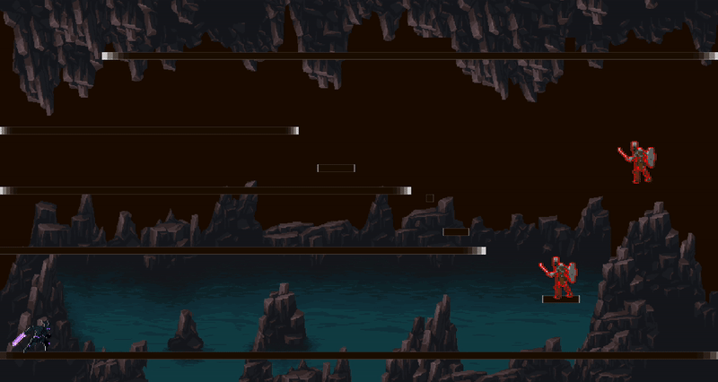

# **Nightborne**

Nightborne is a 2D platformer game set in a dark dungeon where players fight off waves of skeleton enemies. As a skilled warrior, you navigate through challenging levels, using agility and combat prowess to defeat undead foes and uncover secrets hidden within the dungeon’s eerie corridors. The game combines fast-paced action with platforming elements, offering a thrilling adventure for players who enjoy intense battles and exploration.

---

## **Installation**

## Requirements:

- Node.js (v16.0 or compatible)
- Phaser 3.80.1 or later

## Setup & Run the Game:

### 1. Install Node.js

If you don't have Node.js installed, download and install the appropriate version for your system from the [Node.js website](https://nodejs.org/).

### 2. Clone or Download the Project

Clone this repository or download the project files to your local machine.

```bash
git clone https://github.com/c1foZ/nightborne.git
```

### 3. Install Dependencies

Open a terminal/command prompt in the project directory and run the following command to install the required dependencies:

```bash
npm install
```

### 4. Run the Game

After the dependencies are installed, you can start a local development server with the following command:

```bash
npm run dev
```

This will start the game on a local server. You can access it in your browser at [http://localhost:3000](http://localhost:3000) (or another port, depending on your configuration).

---

## **Play Online**

Play Nightborne on [itch.io](https://cifoz.itch.io/nightborne).

---

## **Screenshot**



---

## **License**

This project is licensed under the MIT License. See the [LICENSE](LICENSE) file for more details.
